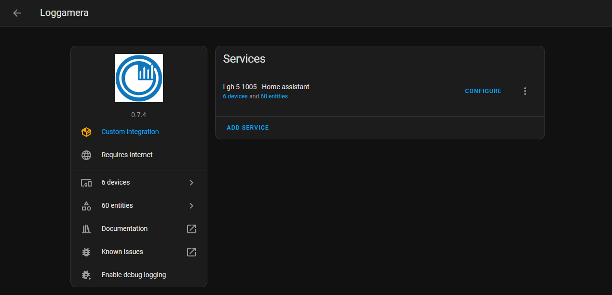
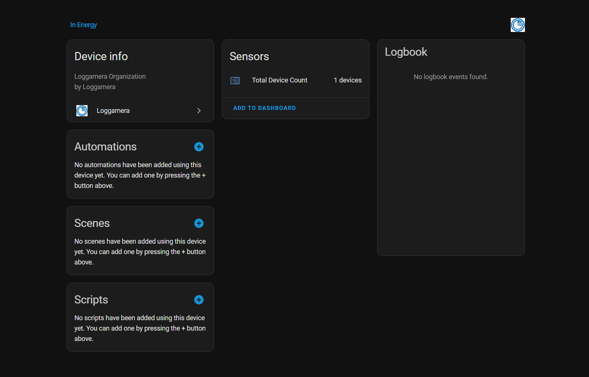
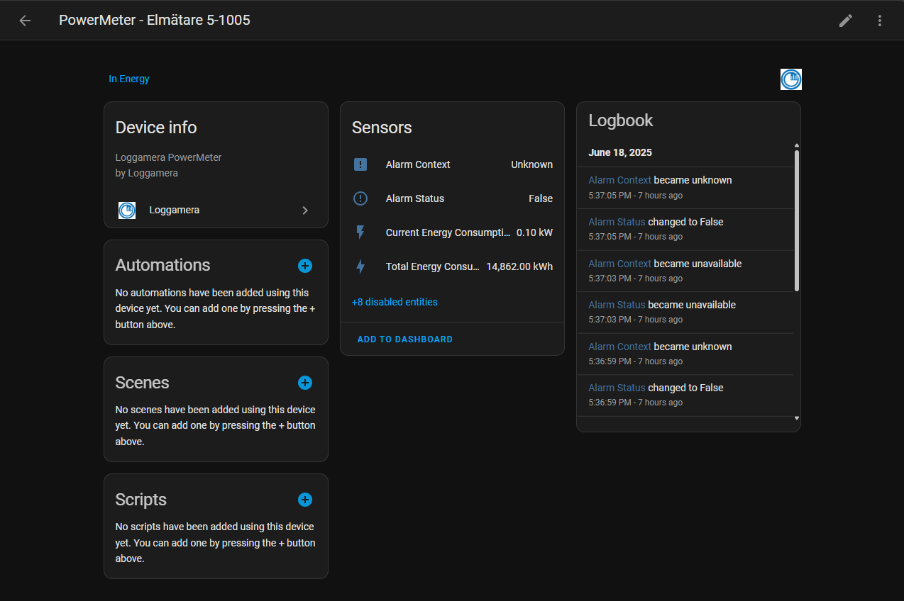
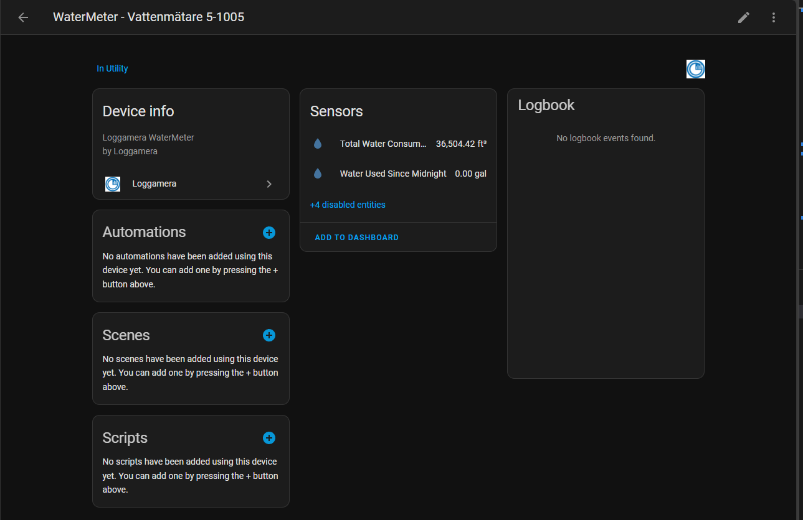
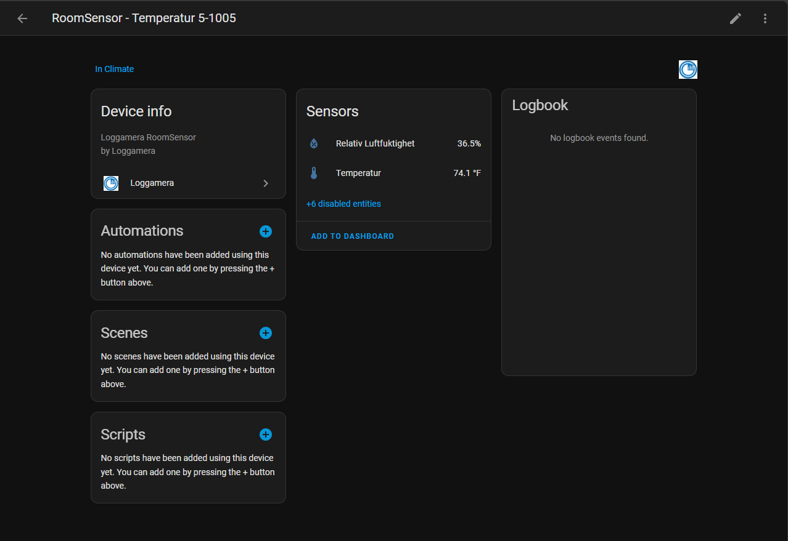
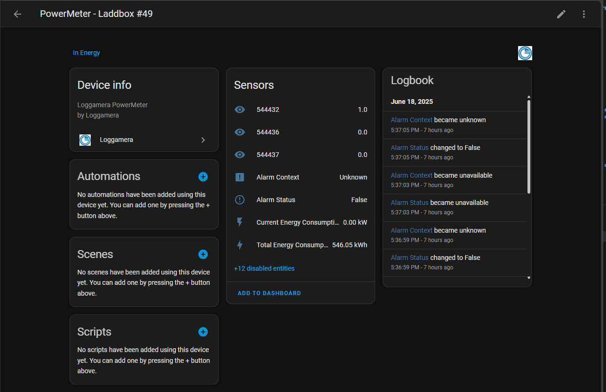
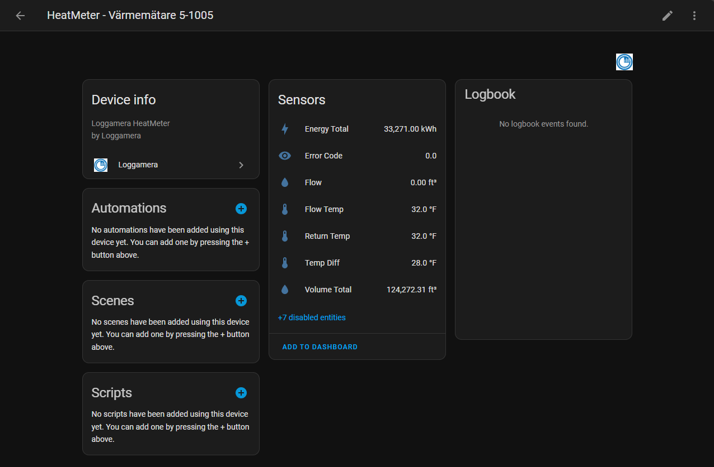
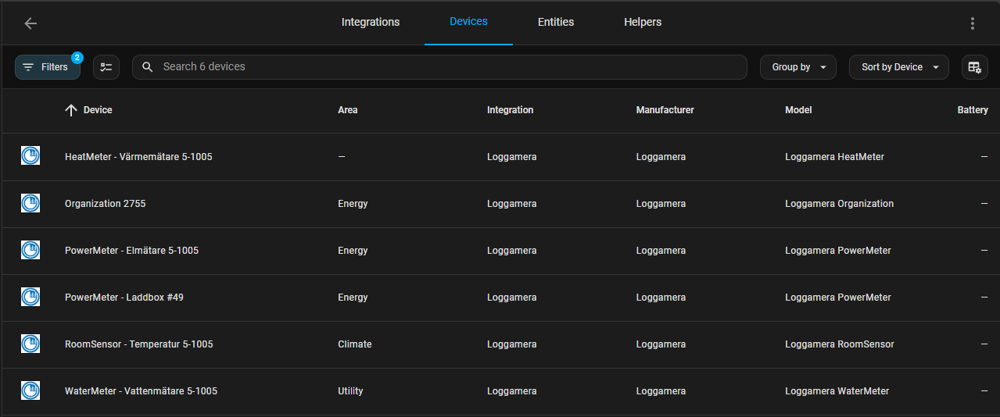

# Loggamera Integration for Home Assistant
[](https://github.com/hacs/integration)
[](https://github.com/delize/home-assistant-loggamera-integration/blob/main/LICENSE)


[](https://github.com/delize/home-assistant-loggamera-integration/releases/latest) [](https://github.com/delize/home-assistant-loggamera-integration/releases/latest) [](https://github.com/delize/home-assistant-loggamera-integration/releases) [](https://github.com/delize/home-assistant-loggamera-integration/releases)


[](https://github.com/delize/home-assistant-loggamera-integration/actions/workflows/hassfest.yaml)
[](https://github.com/delize/home-assistant-loggamera-integration/actions/workflows/hacs.yaml)
[](https://github.com/delize/home-assistant-loggamera-integration/actions/workflows/lint.yaml)
[](https://github.com/delize/home-assistant-loggamera-integration/commit/HEAD)


<details>
<summary>📋 Table of Contents</summary>

- [Loggamera Integration for Home Assistant](#loggamera-integration-for-home-assistant)
  - [Supported Devices](#supported-devices)
  - [Features](#features)
    - [Core Functionality](#core-functionality)
    - [Advanced Sensor Management](#advanced-sensor-management)
    - [Recent Improvements \& Fixes](#recent-improvements--fixes)
    - [Developer Experience](#developer-experience)
  - [Installation](#installation)
    - [HACS Catalog (Recommended)](#hacs-catalog-recommended)
    - [HACS Custom Repo](#hacs-custom-repo)
    - [Manual Installation](#manual-installation)
  - [Example Screenshots](#example-screenshots)
    - [Example Screenshot of Integration Functionality](#example-screenshot-of-integration-functionality)
    - [Example Screenshot of Organization Functionality](#example-screenshot-of-organization-functionality)
    - [Example Screenshot of PowerMeter Functionality (Raw Data Entities Disabled)](#example-screenshot-of-powermeter-functionality-raw-data-entities-disabled)
    - [Example Screenshot of WaterMeter Functionality (Raw Data Entities Disabled)](#example-screenshot-of-watermeter-functionality-raw-data-entities-disabled)
    - [Example Screenshot of RoomSensor Functionality (Raw Data Entities Disabled)](#example-screenshot-of-roomsensor-functionality-raw-data-entities-disabled)
    - [Example Screenshot of PowerMeter / Charging Box Functionality (Raw Data Entities Disabled)](#example-screenshot-of-powermeter--charging-box-functionality-raw-data-entities-disabled)
    - [Example Screenshot of HeatMeter Functionality (Raw Data Entities Disabled)](#example-screenshot-of-heatmeter-functionality-raw-data-entities-disabled)
    - [Example Screenshot of Multiple Devices](#example-screenshot-of-multiple-devices)
  - [Development](#development)
    - [Automated Version Management](#automated-version-management)
    - [Code Quality](#code-quality)
  - [Configuration](#configuration)
  - [Available Entities](#available-entities)
    - [Sensors](#sensors)
      - [**PowerMeter (Electricity Meters)**](#powermeter-electricity-meters)
      - [**RoomSensor (Environmental Monitoring)**](#roomsensor-environmental-monitoring)
      - [**WaterMeter (Water Consumption)**](#watermeter-water-consumption)
      - [**HeatMeter (Heating System Monitoring)**](#heatmeter-heating-system-monitoring)
      - [**HeatPump (Heat Pump Systems)**](#heatpump-heat-pump-systems)
      - [**ChargingStation/Laddbox (EV Charging)**](#chargingstationladdbox-ev-charging)
      - [**Organization Sensors**](#organization-sensors)
      - [**CoolingUnit (Cooling Systems)**](#coolingunit-cooling-systems)
    - [Sensor Behavior Notes](#sensor-behavior-notes)
    - [Binary Sensors](#binary-sensors)
    - [Switches](#switches)
  - [Troubleshooting](#troubleshooting)
    - [Debugging](#debugging)
    - [API Structure](#api-structure)
    - [Diagnostic Tools](#diagnostic-tools)
      - [Basic API Testing](#basic-api-testing)
      - [Advanced Diagnostics](#advanced-diagnostics)
      - [Integration Helpers](#integration-helpers)
    - [Common Issues](#common-issues)
  - [Issues and Support](#issues-and-support)
  - [License](#license)

</details>

This integration allows you to monitor your Loggamera devices in Home Assistant, providing comprehensive energy monitoring and device control capabilities.

**Latest Version Highlights**: This integration has been recently updated with significant improvements including comprehensive **HeatMeter device support** with 7 dedicated sensors, better sensor reliability, resolved configuration warnings, enhanced API validation, performance optimizations, and expanded organization support.

## Supported Devices

- **PowerMeter** (Electricity meters) - Monitor energy consumption and power usage ([Screenshots](#example-screenshot-of-powermeter-functionality-raw-data-entities-disabled))
- **RoomSensor** (Temperature and humidity sensors) - Track environmental conditions ([Screenshots](#example-screenshot-of-roomsensor-functionality-raw-data-entities-disabled))
- **WaterMeter** (Water meters) - Monitor water consumption ([Screenshots](#example-screenshot-of-watermeter-functionality-raw-data-entities-disabled))
- **HeatMeter** (Heat meters) - Comprehensive heating system monitoring with energy consumption, flow rates, supply/return temperatures, temperature differential, and flow volume tracking ([Screenshots](#example-screenshot-of-heatmeter-functionality-raw-data-entities-disabled))
- **CoolingUnit** - Monitor and control cooling systems
- **HeatPump** - Monitor and control heat pump systems

## Features

### Core Functionality

- **Energy Monitoring**: Monitor power consumption in real-time with full Home Assistant Energy dashboard integration
- **Environmental Sensors**: Track temperature and humidity readings from room sensors
- **Water Usage**: Monitor water consumption from water meters
- **Scenario Control**: Execute predefined scenarios through switches
- **Alarm Monitoring**: Binary sensors for device alarm states
- **Multi-Device Support**: Manage multiple Loggamera devices from a single integration
- **Organization Tracking**: Monitor device counts and organization hierarchy

### Advanced Sensor Management

- **Clean Device Interface**: Each device type gets appropriate primary sensors (PowerMeter → 4 clean sensors, WaterMeter → standard water sensors, etc.)
- **Detailed RawData Sensors**: Additional detailed sensors available via RawData endpoint (disabled by default to prevent entity spam)
- **Smart Entity Naming**: Clear naming patterns distinguish between standard sensors (`loggamera_{device_id}_{sensor}`) and detailed sensors (`rawdata_{device_id}_{device_type}_{sensor}`)
- **Dynamic Sensor Detection**: Automatically detects and properly configures unknown sensors using intelligent analysis of API metadata
- **User Control**: Standard sensors enabled by default, detailed sensors can be manually enabled per user preference
- **Improved Sensor Availability**: Enhanced sensor state management with better offline detection

### Recent Improvements & Fixes

- **HeatMeter Support**: Comprehensive new support for HeatMeter devices with 7 dedicated sensors (energy, volume, flow rate, supply/return temperatures, temperature differential, error codes)
- **Configuration Warning Resolution**: Fixed warning about `config_entry` parameter in async setup
- **Enhanced API Validation**: Improved validation for untested API endpoints
- **Better Error Handling**: More robust error handling for API connectivity issues
- **Sensor Reliability**: Fixed sensor availability and state management issues
- **Performance Optimizations**: Reduced unnecessary API calls and improved caching mechanisms
- **Organization Support**: Added comprehensive organization and device hierarchy tracking
- **Async File Operations**: Fixed blocking file operations that could impact Home Assistant performance

### Developer Experience

- **Comprehensive Diagnostics**: Built-in diagnostic tools for troubleshooting
- **Robust API Handling**: Intelligent endpoint selection with graceful fallbacks
- **Future-Proof Architecture**: Handles new device types and unknown sensors automatically
- **Extensive Logging**: Detailed logging for debugging and development
- **Code Quality**: Pre-commit hooks and automated linting ensure consistent code quality

## Installation

### HACS Catalog (Recommended)

1. Open HACS in your Home Assistant instance
2. Go to Integrations
3. Search for "Loggamera" in HACS and install
4. Restart Home Assistant

### HACS Custom Repo

1. Open HACS in your Home Assistant instance
2. Go to Integrations
3. Click the three dots in the top right corner and select "Custom repositories"
4. Add this repository: `https://github.com/delize/home-assistant-loggamera-integration`
5. Select "Integration" as the category
6. Click "Add"
7. Search for "Loggamera" in HACS and install
8. Restart Home Assistant

### Manual Installation

1. Download the latest release from [GitHub](https://github.com/delize/home-assistant-loggamera-integration/releases)
2. Extract the contents and copy the `custom_components/loggamera` directory to your Home Assistant `custom_components` directory
3. Restart Home Assistant


## Example Screenshots

### Example Screenshot of Integration Functionality



### Example Screenshot of Organization Functionality



### Example Screenshot of PowerMeter Functionality (Raw Data Entities Disabled)



### Example Screenshot of WaterMeter Functionality (Raw Data Entities Disabled)



### Example Screenshot of RoomSensor Functionality (Raw Data Entities Disabled)



### Example Screenshot of PowerMeter / Charging Box Functionality (Raw Data Entities Disabled)



### Example Screenshot of HeatMeter Functionality (Raw Data Entities Disabled)



### Example Screenshot of Multiple Devices




## Development

This project uses automated workflows and code quality tools:

### Automated Version Management
- **Automatic Version Bumping**: PRs with appropriate labels (`major`, `minor`, `patch`) automatically trigger version bumps
- **Smart Release Workflow**: Creates GitHub releases with automatic changelog generation
- **Auto-merge**: Version bump PRs are automatically merged after passing all checks

### Code Quality
- **Pre-commit Hooks**: Automated code formatting and linting on every commit
- **Continuous Integration**: All PRs are validated with hassfest, HACS, and custom linting
- **YAML Linting**: All workflow files are validated for proper syntax

For development setup, see [CONTRIBUTING.md](CONTRIBUTING.md).

## Configuration

The integration is configured through the Home Assistant UI with improved setup validation:

1. Go to Configuration > Integrations
2. Click "Add Integration"
3. Search for "Loggamera"
4. Enter your API key (found in the Loggamera portal, you may need to reach out to Loggamera)

**Note**: Recent updates include enhanced configuration validation to prevent setup issues and improved error messaging during the configuration process.

## Available Entities

The integration creates various entity types based on your Loggamera devices:

### Sensors

The integration creates comprehensive sensor entities based on your Loggamera device types:

#### **PowerMeter (Electricity Meters)**
**Standard Sensors:**
- **Total Energy Consumption** (kWh) - Cumulative energy consumed
- **Current Power Consumption** (kW) - Real-time power usage
- **Alarm Status** - Device alarm state (active/inactive)
- **Alarm Context** - Descriptive alarm information

**Detailed RawData Sensors** (disabled by default):
- **Energy Total** (kWh) - Alternative total energy reading
- **Energy Interval** (kWh) - Energy consumed in measurement interval
- **Power** (W) - Instantaneous power reading
- **Power Average** (W) - Average power over interval
- **Power Peak** (W) - Peak power demand
- **Voltage** (V) - Line voltage
- **Current Phase 1/2/3** (A) - Current per phase
- **Energy Phase 1/2/3** (kWh) - Energy consumption per phase
- **Voltage Phase 1/2/3** (V) - Voltage per phase
- **Consumption Interval** (kWh) - Interval-based consumption

#### **RoomSensor (Environmental Monitoring)**
**Standard Sensors:**
- **Temperature** (°C) - Ambient temperature
- **Relative Humidity** (%) - Air humidity level

**Detailed RawData Sensors** (disabled by default):
- **Battery** (%) - Sensor battery level
- **Signal Strength RSSI** (dBm) - Wireless signal strength
- **Signal to Noise Ratio** (dB) - Communication quality metric
- **Spreading Factor** - LoRaWAN communication parameter

#### **WaterMeter (Water Consumption)**
**Standard Sensors:**
- **Total Water Consumption** (m³) - Cumulative water usage
- **Water Used Since Midnight** (L) - Daily water consumption

**Detailed RawData Sensors** (disabled by default):
- **Meter Value** (m³) - Raw meter reading
- **Current Flow** (L/min) - Real-time water flow rate
- **Consumption Interval** (L) - Water used in measurement interval

#### **HeatMeter (Heating System Monitoring)**
**All sensors via RawData endpoint** (disabled by default):
- **Total Energy** (kWh) - Cumulative heating energy consumed
- **Total Volume** (m³) - Total volume of heated medium
- **Flow Rate** (m³/h) - Current flow rate of heating medium
- **Flow Temperature** (°C) - Supply/inlet temperature
- **Return Temperature** (°C) - Return/outlet temperature
- **Temperature Difference** (°C) - Delta T between flow and return
- **Error Code** - Device status and error information

#### **HeatPump (Heat Pump Systems)**
**Standard Sensors:**
- **Heat Carrier Inlet/Outlet Temperature** (°C) - Heating circuit temperatures
- **Brine Inlet/Outlet Temperature** (°C) - Ground/air circuit temperatures
- **Reduced Mode** - Power-saving mode status
- **Pump Activity** - Heat pump operational state
- **Filter Alarm** - Filter maintenance alert

**Detailed RawData Sensors** (disabled by default):
- **Hot Water Temperature** (°C) - Domestic hot water temperature
- **Set Room Temperature** (°C) - Target room temperature
- **Outdoor Temperature** (°C) - External temperature sensor
- **Hot Gas Temperature** (°C) - Refrigerant temperature
- **Heat Carrier 1** (°C) - Primary heating circuit
- **Brine Incoming/Outgoing** (°C) - Geothermal/air temperatures

#### **ChargingStation/Laddbox (EV Charging)**
**Detailed RawData Sensors** (disabled by default):
- **Total Consumption** (kWh) - Lifetime energy delivered
- **Session Consumption** (kWh) - Current charging session energy
- **Consumption Interval** (kWh) - Energy in measurement period
- **Voltage Phase 1/2/3** (V) - Line voltage per phase
- **Current Phase 1/2/3** (A) - Charging current per phase
- **Charging State** - Current charging status
- **Load Balanced** - Load balancing active status
- **Status Code A/B** - Device operational status codes
- **Firmware/Hardware Version** - Device version information

#### **Organization Sensors**
**Management and Monitoring:**
- **Total Device Count** - Number of devices in organization
- **Total Organization Count** - Number of accessible organizations
- **Parent Organization** - Parent organization name
- **Child Organizations Count** - Number of child organizations
- **User Count** - Number of users in organization
- **Member Count** - Number of organization members

#### **CoolingUnit (Cooling Systems)**
**Standard Sensors:**
- Device-specific cooling metrics based on unit capabilities
- Temperature and operational status sensors

### Sensor Behavior Notes

- **Standard sensors** are enabled by default and provide the most commonly needed data
- **RawData sensors** are disabled by default to prevent entity spam but can be manually enabled
- **Energy sensors** are automatically compatible with Home Assistant's Energy dashboard
- **Temperature sensors** support both Celsius and device-native units
- **All sensors** include proper device classes for optimal Home Assistant integration
- **Unknown sensors** are automatically detected and configured using intelligent metadata analysis

### Binary Sensors
- **Alarm Status** - Indicates if device alarms are active
- **Device connectivity** - Shows if devices are online/offline

### Switches
- **Scenario Controls** - Execute predefined scenarios on your Loggamera devices

All sensors are automatically discovered and configured based on your device capabilities. Energy sensors are compatible with the Home Assistant Energy dashboard for comprehensive energy monitoring.


## Troubleshooting

### Debugging

To enable debug logging for this integration, add the following to your `configuration.yaml`:

```yaml
logger:
  default: warning
  logs:
    custom_components.loggamera: debug
```

### API Structure

The Loggamera API is structured as follows:

- **PowerMeter**: Returns energy data with values for `PowerInkW`, `ConsumedTotalInkWh`, and additional power metrics
- **RawData**: Provides detailed sensor values with numerical identifiers (544352, 544399, etc.)
- **RoomSensor**: Returns temperature and humidity data in `Values` array
- **WaterMeter**: Returns water consumption data
- **Scenarios**: Controls execution of defined scenarios

### Diagnostic Tools

The integration includes comprehensive diagnostic tools in the `tools/` directory:

#### Basic API Testing
```bash
# Test API connectivity and device discovery
python tools/test_powermeter.py YOUR_API_KEY --verbose

# Explore specific API endpoints
python tools/loggamera_api_explorer.py YOUR_API_KEY PowerMeter --device-id YOUR_DEVICE_ID
```

#### Advanced Diagnostics
```bash
# Monitor real-time power meter updates
python tools/monitor_powermeter_updates.py --api-key YOUR_API_KEY --device-id YOUR_DEVICE_ID

# Analyze update frequency patterns
python tools/analyze_update_frequency.py YOUR_API_KEY YOUR_DEVICE_ID
```

Look at the docss/TROUBLESHOOTING.md file for more information.

#### Integration Helpers
```bash
# Generate Home Assistant sensor configurations
python tools/ha_sensor_config_helper.py YOUR_API_KEY YOUR_DEVICE_ID

# Comprehensive diagnostic report
python tools/loggamera_diagnostic.py YOUR_API_KEY
```

### Common Issues

1. **SSL/TLS Errors**: Use the TLS diagnostic tool to check certificate issues
2. **API Key Issues**: Verify your API key with the Loggamera portal
3. **Device Not Found**: Use the diagnostic tools to verify device IDs and organization access
4. **Update Frequency**: PowerMeter data typically updates every 30 minutes
5. **Sensor Unavailable**: Recent improvements have enhanced sensor availability detection - ensure your devices are online and check network connectivity
6. **Configuration Warnings**: Latest version resolves configuration entry warnings during startup
7. **Performance Issues**: Recent optimizations reduce API calls and improve response times

## Issues and Support

If you encounter issues:

1. Enable debug logging and check Home Assistant logs
2. Check the docs/API_ERRATA.md file for a known list of issues and errors
3. Use the diagnostic tools to test your API connection or survey the list of your devices and organization
4. Check the [troubleshooting documentation](docs/TROUBLESHOOTING.md)
5. Open an issue on [GitHub](https://github.com/delize/home-assistant-loggamera-integration/issues)

## License

This integration is licensed under AGPL License.
