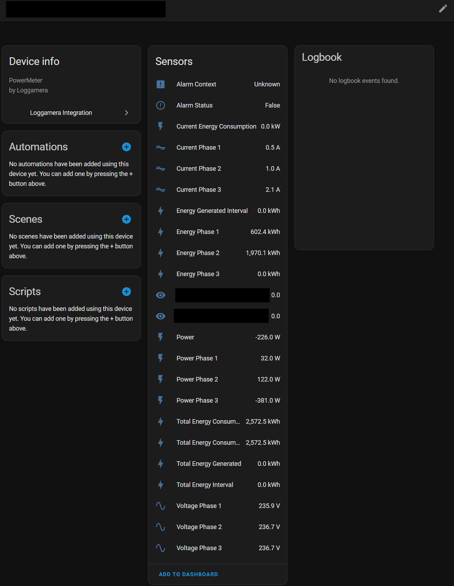

# Loggamera Integration for Home Assistant

This integration allows you to monitor your Loggamera devices in Home Assistant.

## Supported Devices

- PowerMeter (Electricity meters)
- RoomSensor (Temperature and humidity sensors)
- WaterMeter (Water meters)
- CoolingUnit
- HeatPump

## Features

- Monitor power consumption in real-time
- Track energy usage over time
- View temperature and humidity readings
- Control scenarios through switches
- Integration with Home Assistant Energy dashboard

## Example Screenshot



## Installation

### HACS (Recommended)

1. Add this repository as a custom repository in HACS
2. Search for "Loggamera" in HACS and install
3. Restart Home Assistant

### Manual Installation

1. Copy the `custom_components/loggamera` directory to your Home Assistant `custom_components` directory
2. Restart Home Assistant

## Configuration

The integration is configured through the Home Assistant UI:

1. Go to Configuration > Integrations
2. Click "Add Integration"
3. Search for "Loggamera"
4. Enter your API key (found in the Loggamera portal, you may need to reach out to Loggamera)


## Troubleshooting

### Debugging

To enable debug logging for this integration, add the following to your `configuration.yaml`:

```yaml
logger:
  default: warning
  logs:
    custom_components.loggamera: debug
```

### API Structure

The Loggamera API is structured as follows:

- **PowerMeter**: Returns energy data in `PowerReadings` array, with values for `PowerInkW`, `ConsumedTotalInkWh`, and `ExportedTotalInkWh`
- **RoomSensor**: Returns temperature and humidity data in `Values` array
- **WaterMeter**: Returns water consumption data
- **Scenarios**: Controls execution of defined scenarios

### Testing the API

A CLI tool is included to help with API testing. You can run it as follows:

```bash
python tools/loggamera_api_explorer.py YOUR_API_KEY PowerMeter --device-id YOUR_DEVICE_ID
```

## Issues and Support

If you encounter issues, please check the Home Assistant logs first, then open an issue in the GitHub repository.

## License

This integration is licensed under AGPL License.
