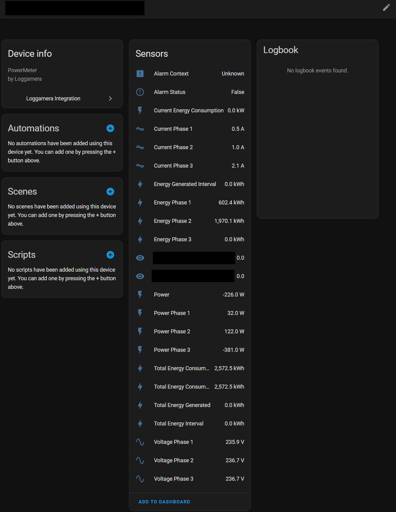

# Loggamera Integration for Home Assistant
[](https://github.com/hacs/integration)
[](https://github.com/delize/home-assistant-loggamera-integration/blob/main/LICENSE)

[](https://github.com/delize/home-assistant-loggamera-integration/releases/latest) [](https://github.com/delize/home-assistant-loggamera-integration/releases/latest) || [](https://github.com/delize/home-assistant-loggamera-integration/releases) [](https://github.com/delize/home-assistant-loggamera-integration/releases)


[](https://github.com/delize/home-assistant-loggamera-integration/actions/workflows/hassfest.yaml)
[](https://github.com/delize/home-assistant-loggamera-integration/actions/workflows/hacs.yaml)
[](https://github.com/delize/home-assistant-loggamera-integration/actions/workflows/lint.yaml)
[](https://github.com/delize/home-assistant-loggamera-integration/commit/HEAD)


This integration allows you to monitor your Loggamera devices in Home Assistant, providing comprehensive energy monitoring and device control capabilities.

## Supported Devices

- **PowerMeter** (Electricity meters) - Monitor energy consumption and power usage
- **RoomSensor** (Temperature and humidity sensors) - Track environmental conditions
- **WaterMeter** (Water meters) - Monitor water consumption
- **CoolingUnit** - Monitor and control cooling systems
- **HeatPump** - Monitor and control heat pump systems

## Features

- **Energy Monitoring**: Monitor power consumption in real-time with full Home Assistant Energy dashboard integration
- **Environmental Sensors**: Track temperature and humidity readings from room sensors
- **Water Usage**: Monitor water consumption from water meters
- **Scenario Control**: Execute predefined scenarios through switches
- **Alarm Monitoring**: Binary sensors for device alarm states
- **Multi-Device Support**: Manage multiple Loggamera devices from a single integration
- **Comprehensive Diagnostics**: Built-in diagnostic tools for troubleshooting

## Example Screenshot



## Installation

### HACS (Recommended)

1. Open HACS in your Home Assistant instance
2. Go to Integrations
3. Click the three dots in the top right corner and select "Custom repositories"
4. Add this repository: `https://github.com/delize/home-assistant-loggamera-integration`
5. Select "Integration" as the category
6. Click "Add"
7. Search for "Loggamera" in HACS and install
8. Restart Home Assistant

### Manual Installation

1. Download the latest release from [GitHub](https://github.com/delize/home-assistant-loggamera-integration/releases)
2. Extract the contents and copy the `custom_components/loggamera` directory to your Home Assistant `custom_components` directory
3. Restart Home Assistant

## Configuration

The integration is configured through the Home Assistant UI:

1. Go to Configuration > Integrations
2. Click "Add Integration"
3. Search for "Loggamera"
4. Enter your API key (found in the Loggamera portal, you may need to reach out to Loggamera)

## Available Entities

The integration creates various entity types based on your Loggamera devices:

### Sensors
- **Energy Consumption** (`sensor.loggamera_total_energy_consumption`) - Total energy consumed in kWh
- **Current Power** (`sensor.loggamera_current_energy_consumption`) - Current power usage in kW
- **Temperature** (for RoomSensors) - Temperature readings in °C
- **Humidity** (for RoomSensors) - Humidity readings in %
- **Water Usage** (for WaterMeters) - Water consumption data
- **Device-specific metrics** - Additional sensors based on device capabilities

### Binary Sensors
- **Alarm Status** - Indicates if device alarms are active
- **Device connectivity** - Shows if devices are online/offline

### Switches
- **Scenario Controls** - Execute predefined scenarios on your Loggamera devices

All sensors are automatically discovered and configured based on your device capabilities. Energy sensors are compatible with the Home Assistant Energy dashboard for comprehensive energy monitoring.


## Troubleshooting

### Debugging

To enable debug logging for this integration, add the following to your `configuration.yaml`:

```yaml
logger:
  default: warning
  logs:
    custom_components.loggamera: debug
```

### API Structure

The Loggamera API is structured as follows:

- **PowerMeter**: Returns energy data with values for `PowerInkW`, `ConsumedTotalInkWh`, and additional power metrics
- **RawData**: Provides detailed sensor values with numerical identifiers (544352, 544399, etc.)
- **RoomSensor**: Returns temperature and humidity data in `Values` array
- **WaterMeter**: Returns water consumption data
- **Scenarios**: Controls execution of defined scenarios

### Diagnostic Tools

The integration includes comprehensive diagnostic tools in the `tools/` directory:

#### Basic API Testing
```bash
# Test API connectivity and device discovery
python tools/test_powermeter.py YOUR_API_KEY --verbose

# Explore specific API endpoints
python tools/loggamera_api_explorer.py YOUR_API_KEY PowerMeter --device-id YOUR_DEVICE_ID
```

#### Advanced Diagnostics
```bash
# Monitor real-time power meter updates
python tools/monitor_powermeter_updates.py --api-key YOUR_API_KEY --device-id YOUR_DEVICE_ID

# Analyze update frequency patterns
python tools/analyze_update_frequency.py YOUR_API_KEY YOUR_DEVICE_ID

# Test SSL/TLS connectivity
bash tools/diagnose_tls.sh
```

#### Integration Helpers
```bash
# Generate Home Assistant sensor configurations
python tools/ha_sensor_config_helper.py YOUR_API_KEY YOUR_DEVICE_ID

# Comprehensive diagnostic report
python tools/loggamera_diagnostic.py YOUR_API_KEY
```

### Common Issues

1. **SSL/TLS Errors**: Use the TLS diagnostic tool to check certificate issues
2. **API Key Issues**: Verify your API key with the Loggamera portal
3. **Device Not Found**: Use the diagnostic tools to verify device IDs and organization access
4. **Update Frequency**: PowerMeter data typically updates every 30 minutes

## Issues and Support

If you encounter issues:

1. Enable debug logging and check Home Assistant logs
2. Use the diagnostic tools to test your API connection
3. Check the [troubleshooting documentation](docs/TROUBLESHOOTING.md)
4. Open an issue on [GitHub](https://github.com/delize/home-assistant-loggamera-integration/issues)

## License

This integration is licensed under AGPL License.
